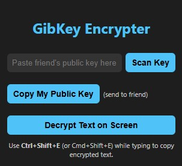

# Gibkey

A browser extension that allow for end-to-end encryption on any messaging platform (such as Discord) using **ECDH** and **AES-GCM** encryption.  

## Features

- Generate a unique public/private key pair per user
- Easily share public keys as a Base64 string
- Automatically decrypt any encrypted messages
- No messages are stored; all encryption/decryption happens locally in the browser

## Installation

1. Clone the repository
2. Load the extension into your browser
    - Open Chrome
    - Go to `chrome://extensions/`
    - Enable developer mode
    - Click `Load Unpacked` and select the project folder
